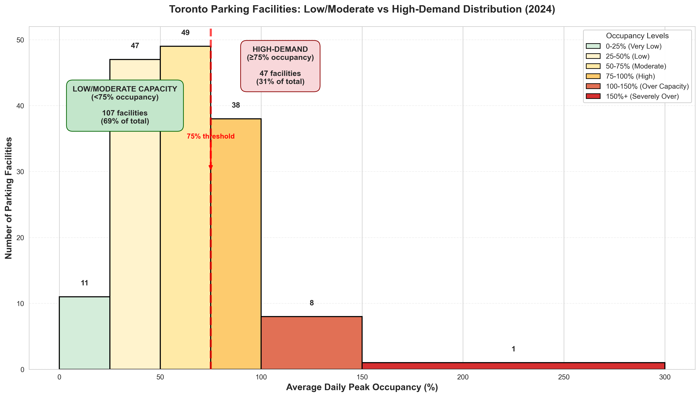
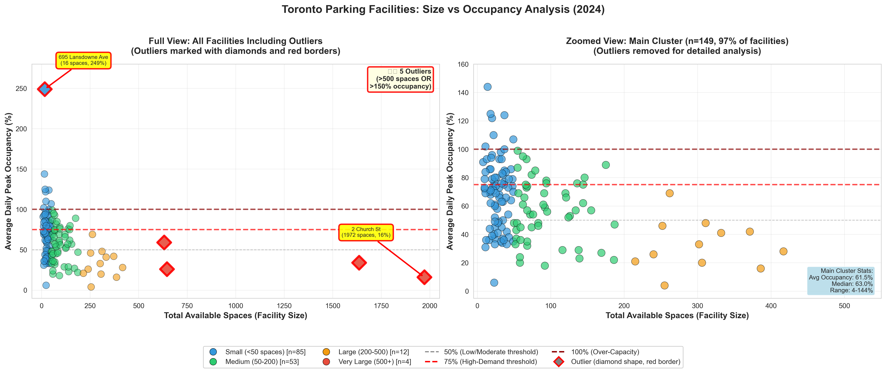

# Data Visualization

## Assignment 3: Final Project

### Requirements:
- We will finish this class by giving you the chance to use what you have learned in a practical context, by creating data visualizations from raw data. 
- Choose a dataset of interest from the [City of Toronto’s Open Data Portal](https://www.toronto.ca/city-government/data-research-maps/open-data/) or [Ontario’s Open Data Catalogue](https://data.ontario.ca/). 
- Using Python and one other data visualization software (Excel or free alternative, Tableau Public, any other tool you prefer), create two distinct visualizations from your dataset of choice.  
- For each visualization, describe and justify: 

## First Visualization
### Toronto Parking Facilities: Low/Moderate vs High-Demand Distribution (2024)

<mark>What software did you use to create your data visualization?</mark> 
I used Python with Matplotlib, Seaborn, and Pandas libraries

<mark>Who is your intended audience? </mark> 
    Toronto Parking Authority administrators and City planners and transportation policy makers

<mark>What information or message are you trying to convey with your visualization? </mark> 
    Toronto's parking facilities show uneven utilization: while most operate below 75% capacity, specific high-demand locations need attention, and some facilities exceed 100% occupancy due to overselling monthly permits. The histogram shows:
    - 69% of facilities operate at moderate to low capacity 
    - 31% are high-demand (75%+ occupancy)  
    - 9 facilities are over-capacity, suggesting need for expansion or demand management

<mark>What aspects of design did you consider when making your visualization? How did you apply them? With what elements of your plots? </mark> 
    - **Color Coding**: Traffic light colors (green→yellow→orange→red) to indicate occupancy levels from safe to critical.
    - **Clarity:** Direct data labels on bars eliminate need to read y-axis precisely. Clear bins with descriptive categories.
    - **Context:** Statistics box provides reference numbers. Interpretation note explains why >100% is possible.
    
 <mark>How did you ensure that your data visualizations are reproducible? If the tool you used to make your data visualization is not reproducible, how will this impact your data visualization? </mark> 
All the code are well documented and no need to download any dataset. The dataset that used by fetching the metadata from the "parking-occupancy" dataset and convert the API data to a dataframe. All parameters (colors, bins, fonts) explicitly defined in code

If a non-reproducible tool like manual Excel charting were used, it would be nearly impossible to guarantee the same result. This would impact the visualization by making it unreliable for auditing, difficult to update with new data, and untrustworthy for making important policy decisions.

<mark>How did you ensure that your data visualization is accessible?  </mark> 
    - **High contrast:** Dark text on light background, colored bars with black borders
    - **Not color-dependent:** Beside colors, each bar labeled with numbers, readable in grayscale
    - **Large fonts:** 10-15pt sizes, readable from distance or when printed
    - **Simple chart type:** Histogram universally understood
    - **Clear interpretation:** Annotation boxes explain what the data means

<mark>Who are the individuals and communities who might be impacted by your visualization? </mark>  
    - TPA operations and financial planning teams
    - City government making infrastructure decisions
    - Commuters and residents choosing where to park
    - Business owners dependent on customer parking

<mark>How did you choose which features of your chosen dataset to include or exclude from your visualization? </mark> 
    - **2024 data:** Full year provides complete picture without seasonal variation
    - **Facility counts:** Shows how common each occupancy level is 

<mark>What ‘underwater labour’ contributed to your final data visualization product?</mark> 
    - **Data preparation:** Converting text percentages to numeric values, researching TPA methodology to understand >100% occupancy, and selecting optimal time period.
    - **Trial and error:** Testing multiple chart types (bar charts, scatter plots) and experimenting with 5-10 bin sizes and color schemes before finding effective visualization.
    - **Refinement:** Adjusting labels, fonts, annotation boxes, writing code documentation, and testing reproducibility. Approximately 3-5 hours total work.

----

## Second Visualization
### Toronto Parking Facilities: Size vs Occupancy Analysis (2024)

<mark>What software did you use to create your data visualization?</mark> 
I used Python with Matplotlib, Seaborn, and Pandas libraries

<mark>Who is your intended audience?</mark> 
The intended audience is policymakers and urban planners within the Toronto municipal government. This includes officials in departments responsible for transportation, parking management, and city infrastructure who need data-driven insights to make decisions about resource allocation, pricing, and future development.

<mark>What information or message are you trying to convey with your visualization?</mark> 
**The core message is:** "To effectively manage Toronto's parking, we must address two distinct issues: the critical outliers and the broader trends within the main cluster of facilities."
**More specifically:**
- **Outliers (Left Plot):** A small number of facilities have extreme characteristics (either massively oversized or severely over-capacity) that require immediate, targeted intervention.
- **Main Cluster (Right Plot):** For the vast majority of facilities, there is a clear, inverse relationship between size and occupancy. Larger parking facilities are, on average, significantly underutilized.

<mark>What aspects of design did you consider when making your visualization? How did you apply them? With what elements of your plots?</mark> 
To ensure clarity, I used a dual-plot design: one showing all data (with outliers highlighted) and a second "zoomed-in" view for the main cluster. This separates extreme cases from the general trend. I immediately identified outliers with red-bordered diamond shapes, while using clear titles, axis labels, and threshold lines (50%, 75%, 100%) to provide essential context for interpretation.

<mark>How did you ensure that your data visualizations are reproducible? If the tool you used to make your data visualization is not reproducible, how will this impact your data visualization?</mark> 

All the code are well documented and no need to download any dataset. The dataset that used by fetching the metadata from the "parking-occupancy" dataset and convert the API data to a dataframe. All parameters (colors, bins, fonts) explicitly defined in code

If a non-reproducible tool like manual Excel charting were used, it would be nearly impossible to guarantee the same result. This would impact the visualization by making it unreliable for auditing, difficult to update with new data, and untrustworthy for making important policy decisions.

<mark>How did you ensure that your data visualization is accessible?</mark> 
- **High contrast:** Dark text on light background, colored bars with black borders
- **Not color-dependent:** Beside colors, each bar labeled with numbers, readable in grayscale
- **Large fonts:** 10-15pt sizes, readable from distance or when printed
- **Simple chart type:** Histogram universally understood
- **Clear interpretation:** Annotation boxes explain what the data means

<mark>Who are the individuals and communities who might be impacted by your visualization?</mark> 
- TPA operations and financial planning teams
- City government making infrastructure decisions
- Commuters and residents choosing where to park
- Business owners dependent on customer parking

<mark>How did you choose which features of your chosen dataset to include or exclude from your visualization?</mark> 
- **Total Available Spaces:** This is the key metric for "Facility Size," which is the central subject of the analysis.
- **Average Daily Peak Occupancy %:** This is the primary performance metric we want to analyze against size.
- **Car Park Location:** Used to label specific outliers for context (e.g., "695 Lansdowne Ave").

<mark>What ‘underwater labour’ contributed to your final data visualization product?</mark> 
The "underwater labour" was the unseen work before the final plot, including: cleaning the data (fixing formats, handling blanks), analyzing it (finding outliers, calculating statistics), and iteratively coding the visualization to highlight key insights like the size-occupancy relationship (Writing and debugging the code to create the dual-plot figure. Experimenting with colors, shapes, and annotations to make the key insights visually prominent. Adjusting scales and layouts to improve readability.) Approximately 4-6 hours total work.

------

- This assignment is intentionally open-ended - you are free to create static or dynamic data visualizations, maps, or whatever form of data visualization you think best communicates your information to your audience of choice! 
- Total word count should not exceed **(as a maximum) 1000 words** 
 
### Why am I doing this assignment?:  
- This ongoing assignment ensures active participation in the course, and assesses the learning outcomes: 
* Create and customize data visualizations from start to finish in Python
* Apply general design principles to create accessible and equitable data visualizations
* Use data visualization to tell a story  
- This would be a great project to include in your GitHub Portfolio – put in the effort to make it something worthy of showing prospective employers!

### Rubric:

| Component         | Scoring  | Requirement                                                                 |
|-------------------|----------|-----------------------------------------------------------------------------|
| Data Visualizations | Complete/Incomplete | - Data visualizations are distinct from each other - Data visualizations are clearly identified - Different sources/rationales (text with two images of data, if visualizations are labeled) - High-quality visuals (high resolution and clear data) - Data visualizations follow best practices of accessibility |
| Written Explanations | Complete/Incomplete | - All questions from assignment description are answered for each visualization - Explanations are supported by course content or scholarly sources, where needed |
| Code              | Complete/Incomplete | - All code is included as an appendix with your final submissions - Code is clearly commented and reproducible |

## Submission Information

🚨 **Please review our [Assignment Submission Guide](https://github.com/UofT-DSI/onboarding/blob/main/onboarding_documents/submissions.md)** 🚨 for detailed instructions on how to format, branch, and submit your work. Following these guidelines is crucial for your submissions to be evaluated correctly.

### Submission Parameters:
* Submission Due Date: `23:59 - 11/02/2025`
* The branch name for your repo should be: `assignment-3`
* What to submit for this assignment:
    * A folder/directory containing:
        * This file (assignment_3.md)
        * Two data visualizations 
        * Two markdown files for each both visualizations with their written descriptions.
        * Link to your dataset of choice.
        * Complete and commented code as an appendix (for your visualization made with Python, and for the other, if relevant) 
* What the pull request link should look like for this assignment: `https://github.com/<your_github_username>/visualization/pull/<pr_id>`
    * Open a private window in your browser. Copy and paste the link to your pull request into the address bar. Make sure you can see your pull request properly. This helps the technical facilitator and learning support staff review your submission easily.

Checklist:
- [ ] Create a branch called `assignment-3`.
- [ ] Ensure that the repository is public.
- [ ] Review [the PR description guidelines](https://github.com/UofT-DSI/onboarding/blob/main/onboarding_documents/submissions.md#guidelines-for-pull-request-descriptions) and adhere to them.
- [ ] Verify that the link is accessible in a private browser window.

If you encounter any difficulties or have questions, please don't hesitate to reach out to our team via our Slack. Our Technical Facilitators and Learning Support staff are here to help you navigate any challenges.
